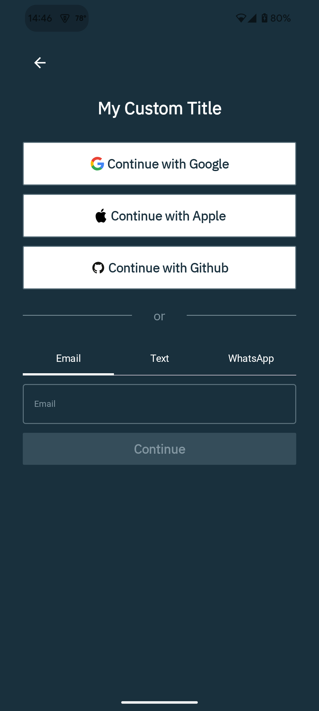

# L10N/I18N/Bring Your Own Copy
(Almost*) Every string in our pre-built UI, both B2C and B2B, is fully customizable using standard Android string resources. If you wish to replace, localize, internationalize, or otherwise customize any of the copy, all you need to do is create a string resource in your application that overrides one of our built-in strings.

For example, our B2C UI has a default main screen title that says "Sign up or log in". If you want to change that, you can just define a string resource like so:
```
<string name="stytch_b2c_main_screen_title">My Custom Title</string>
```
And voila:


If you want to add localization/internationalization to your app, just create a strings resource file (with your desired qualifiers) and provide the appropriate translations.

You can find all of our strings [here](../source/sdk/src/main/res/values/strings.xml).

If you find that you need more granular control than what is currently provided, please open a GitHub issue or submit a pull request describing your use case. We’re happy to review and add additional keys as needed.

---
_* NOTE: There are no hardcoded strings in our UI components, and as such they are fully customizable as described above. However, there may be instances where strings are returned from the network (in the case of an API error) which are not currently customizable. We are actively working to ensure that these are customizable in the future._